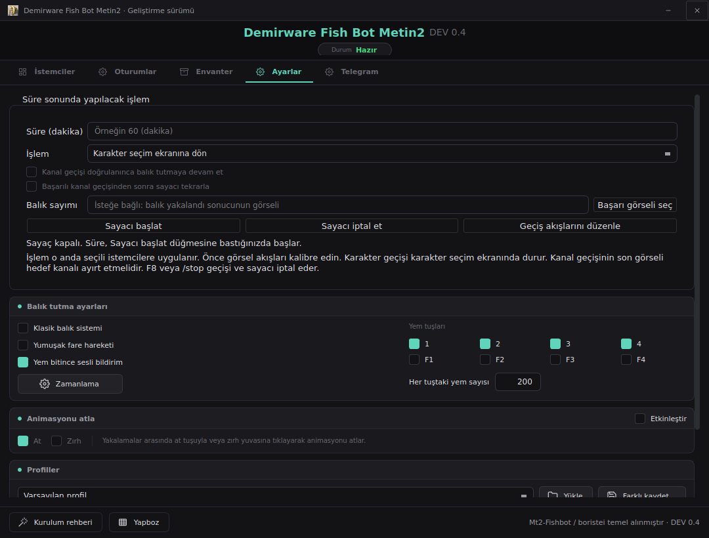
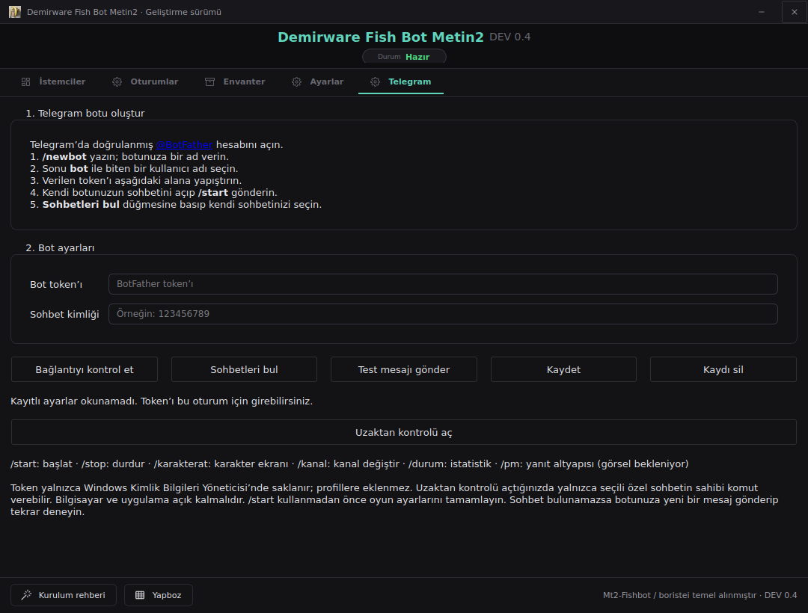

# Demirware Fish Bot Metin2

DEV 0.4 — geliştirme sürümü. Windows/Gameforge üzerinde canlı test ve EXE derlemesi henüz tamamlanmadı. Sekiz istemci desteği canlı ortamda doğrulanmış değildir; tespit edilemezlik veya ban güvenliği garantisi yoktur.

- [Kurulum ve kullanım](BASLANGIC.md)
- [İlerleme ve yol haritası](ROADMAP.md)
- [Değişiklik günlüğü](CHANGELOG.md)
- [Test sonuçları ve sınırlar](docs/TEST_SONUCLARI.md)

credits: [hetzpvp/Mt2-Fishbot](https://github.com/hetzpvp/Mt2-Fishbot)

## DEV 0.4 yenilikleri

Telegram özel sohbetinden `/start`, `/stop`, `/karakterat`, `/kanal`, `/durum` komutları; Ayarlar sekmesinde süreli karakter/kanal geçişi ve isteğe bağlı kanal sonrası devam/tekrar. Geçiş için ekran şablonları kalibre edilmelidir; başarı yalnızca son görsel doğrulanınca bildirilir. `/pm` ekran örnekleri gelene kadar işlem yapmaz. [Komutlar ve kurulum](docs/TELEGRAM_KOMUTLARI.md).

## Arayüz ve bağlantı ayarları

Sade Türkçe ana arayüz; Telegram bot oluşturma rehberi, bağlantı kontrolü, sohbet seçimi, test mesajı ve Windows kimlik deposunda token kaydı. Uzaktan kontrol Telegram sekmesindeki düğmeyle açılır. Güncellemeden sonra `Kur.cmd` dosyasını yeniden çalıştırın.

## Üst projenin özgün README'si

Arşiv amaçlı aşağıda korunmuştur. İndirme/sürüm bilgileri üst projeye aittir; tespit edilemezlik iddiası doğrulanmamıştır.

# MT2 Fishing Bot — v1.2.0
**THIS PROJECT WAS BUILT FOR EDUCATIONAL AND LEARNING PURPOSES ONLY!**

Free fishing minigame bot for Metin2. No subscriptions, no licenses.

Original **Author:** boristei | **Discord:** boristei

---

## Preview

---

## Tutorial/Demo

**Watch the full tutorial:** [YouTube Video](https://youtu.be/M0THxnio894)

---

*For personal use only. Use at your own risk.*
